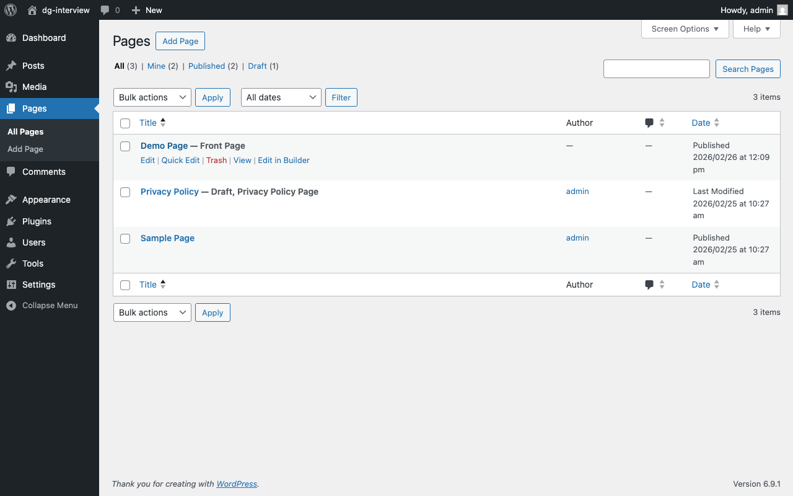
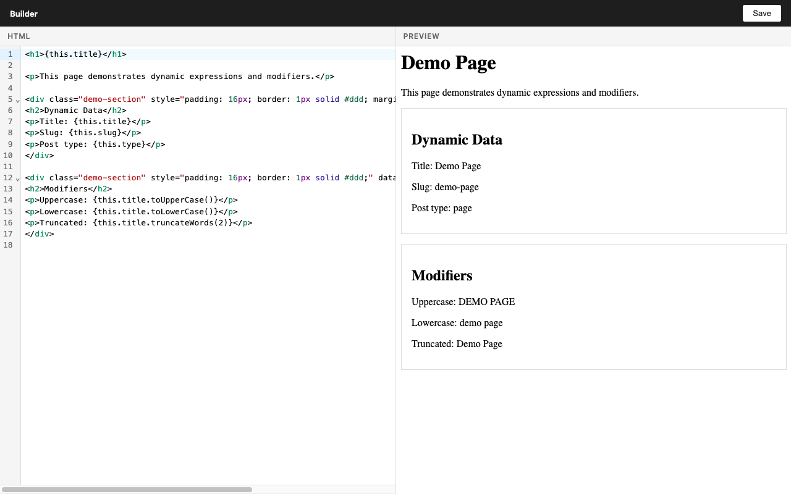
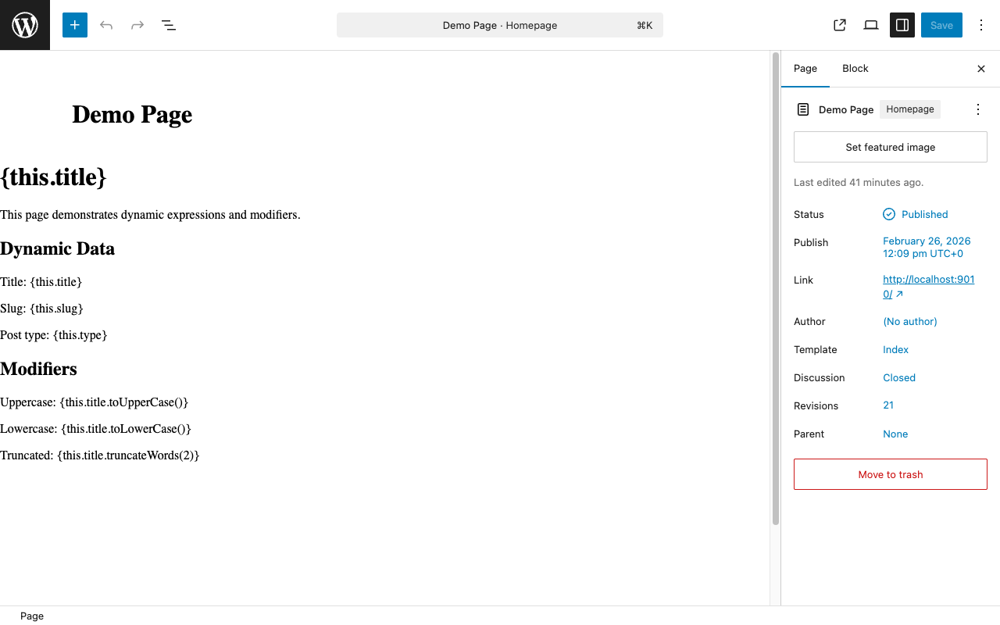
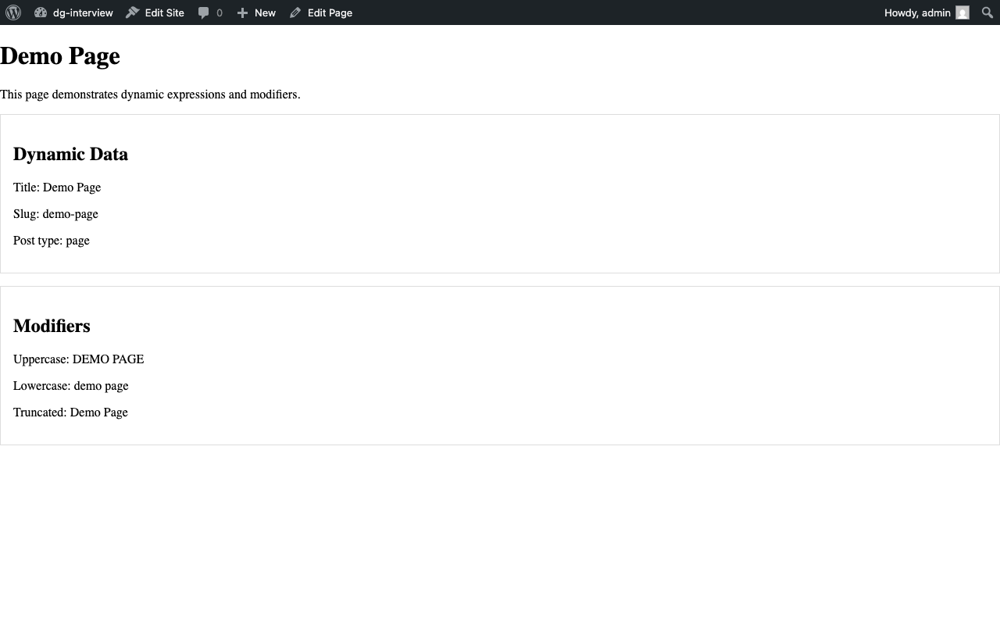

# Technical Interview Project

## What You're Building

This is a simplified WordPress page builder plugin. Users open any page or post and click **"Edit in Builder"** to launch a fullscreen editor with two panels: an HTML code editor on the left and a live preview on the right.



In the editor, users write HTML using a small set of custom block tags — headings, paragraphs, and div containers. Content can include **dynamic expressions** like `{this.title}` that pull live data from the current page. The preview updates as they type.



When the user saves, the plugin serializes their HTML into [Gutenberg block comments](https://developer.wordpress.org/block-editor/explanations/architecture/data-flow/#serialization-and-parsing) (the `<!-- wp:block-name {...} -->` format WordPress uses to store structured content). On the frontend, WordPress renders these blocks server-side through each block's `render_callback`, resolving any dynamic expressions against the actual page data. The same blocks are also editable in the standard Gutenberg editor, where expressions are previewed as resolved values when not selected and shown as raw text when selected for editing:

| Gutenberg editor (resolved preview, raw on select) | Frontend (expressions resolved) |
|---|---|
|  |  |

This means each block exists across three environments: **PHP** (server-side rendering + expression resolution), **React** (Gutenberg editor UI), and **Svelte** (the builder's live preview).

> As part of this interview, you've been assigned three tickets — see **[TICKETS.md](TICKETS.md)**.

## Setup

### Prerequisites

| Tool | Version | Install |
|------|---------|---------|
| [Bun](https://bun.sh) | 1.3+ | `curl -fsSL https://bun.sh/install \| bash` |
| [PHP](https://www.php.net) | 8.1+ | `brew install php` |
| [Composer](https://getcomposer.org) | 2.x | `brew install composer` |
| [Docker](https://www.docker.com) | 28+ | [Docker Desktop](https://www.docker.com/products/docker-desktop/) |
| [Node.js](https://nodejs.org) | 22+ | `brew install node` (needed for `wp-scripts`) |

Docker must be **running** before you start the environment — `wp-env` uses it to spin up the WordPress containers.

> **Windows users:** this project requires WSL2. Run all commands from inside your WSL2 terminal.

> **Before you start**, make sure the following ports are free:
>
> | Port | Used by |
> |------|---------|
> | 9010 | wp-env (dev) |
> | 9011 | wp-env (tests) |
> | 5179 | Vite |

### Quick Start

```bash
# Install all dependencies, build block editor scripts
bun run install:all

# Start the local WordPress environment
bun run dev

# Activate the plugin
bun run wp plugin activate dg-interview

# Activate the interview theme
bun run wp theme activate dg-interview-theme

# Seed demo content
bun run wp dg-interview seed
```

Git hooks are disabled by default for interview speed. If you want Husky + lint-staged locally, create the marker file `./.dg-interview.enable-hooks` and run `bun install` again.

If you need a fresh start, reset and re-seed:

```bash
bun run wp dg-interview reset --force
bun run wp dg-interview seed
```

Once running, WordPress is available at:

- **Development site:** http://localhost:9010
- **Tests site:** http://localhost:9011

Default credentials: `admin` / `password`.

### Verify Setup

Once the plugin is activated and the demo page is seeded, confirm everything works:

1. Open http://localhost:9010/wp-admin/edit.php?post_type=page — you should see a "Demo Page" with an **Edit in Builder** link
2. Click **Edit in Builder** — the builder should open with HTML on the left and a live preview on the right
3. Run `bun run test` — all checks should pass

## Architecture (What You'll Need For The Tickets)

### Block Types

The plugin ships three block types:

| Block | Tag | Key Attributes |
|-------|-----|----------------|
| `dg-interview/heading` | `<h1>`–`<h6>` | `content`, `level` (default 2) |
| `dg-interview/paragraph` | `<p>` | `content` |
| `dg-interview/div` | `<div>` | Inner blocks (children) |

In addition to first-class block attributes, DG blocks can include a generic `htmlAttributes` object for arbitrary HTML attributes such as `id`, `class`, and `style`.

### Internal block mapping attributes

When content is loaded in the builder, rendered HTML includes internal metadata attributes such as:

- `data-dg-block-name`
- `data-dg-block-path`

These are used only to map edited HTML elements back to Gutenberg blocks during save (with `data-dg-block-path` as the stable nested identity). They are not user content and must not be persisted in saved block markup.

### Dynamic Expressions

Content attributes can contain **dynamic expressions** using the syntax `{source.property}` — for example, `{this.title}` resolves to the current page's title. Expressions can also chain **modifiers**: `{this.title.toUpperCase()}`.

**Available source fields** (via `this`):

| Field | Description |
|-------|-------------|
| `this.id` | Post ID |
| `this.title` | Post title |
| `this.slug` | URL slug |
| `this.excerpt` | Post excerpt |
| `this.date` | Publication date |
| `this.type` | Post type (page, post, etc.) |

**Available modifiers:**

| Modifier | Description | Example |
|----------|-------------|---------|
| `toUpperCase()` | Uppercase | `{this.title.toUpperCase()}` |
| `toLowerCase()` | Lowercase | `{this.title.toLowerCase()}` |
| `truncateWords(n)` | Truncate to *n* words | `{this.excerpt.truncateWords(5)}` |
| `truncateChars(n)` | Truncate to *n* characters | `{this.title.truncateChars(20)}` |

Both `truncate` modifiers accept an optional second argument for the ellipsis string (default `"..."`).

Expressions resolve on the **frontend** (PHP `render_block` filter), in the **builder preview** (TypeScript), and in Gutenberg preview states for DG text blocks. Expressions remain raw text in the REST API and when a DG text block is selected for editing in Gutenberg. The resolution logic and modifiers are implemented identically in PHP and TypeScript — see `DynamicContentProcessor` and `Modifiers`/`modifiers.ts`.

In Gutenberg's block canvas for DG text blocks, expressions are shown as:
- **resolved preview** when the block is not selected
- **raw expression text** when the block is selected for editing

### Project Structure

```
src/
├── plugin-src/                    # PHP backend (WordPress plugin)
│   ├── dg-interview.php           # Plugin bootstrap
│   └── classes/
│       ├── Blocks/                # Block interface, implementations, registry
│       │   └── Tests/             # PHPUnit tests (co-located)
│       ├── Builder/               # Admin UI, REST save route, CLI
│       │   └── Tests/
│       └── Expressions/           # Dynamic content processor + modifiers
│           └── Tests/
│
├── frontend/                      # TypeScript / Svelte
│   ├── _utilities/                # Expression engine + modifiers (TS mirrors of PHP)
│   │   └── *.test.ts              # Vitest tests (co-located)
│   └── Builder/src/               # Builder app (editor + preview)
│       └── components/            # Svelte block rendering components
│
└── block-editor/                  # React / Gutenberg
    └── wp-script/src/blocks/      # Block editor UI components
```

## Commands

### Day-to-day commands

```bash
bun run wp [command]            # Run any WP-CLI command
bun run debug:log               # Read the WordPress debug log
bun run build:editor            # One-time build of block editor React code
bun run watch:editor            # Watch mode (rebuilds on save)
```

### Running Tests

```bash
bun run test          # All checks (phpcs + phpstan + PHPUnit + Vitest + tsc + eslint)
bun run test:php      # PHP tests only (phpcs + phpstan + PHPUnit)
bun run phpcs         # Code style checks
bun run phpstan       # Static analysis
bun run phpunit       # PHPUnit only (runs inside the wp-env Docker container)
bun run vitest        # TypeScript tests only
bun run test:watch    # Watch mode for TS tests
```
